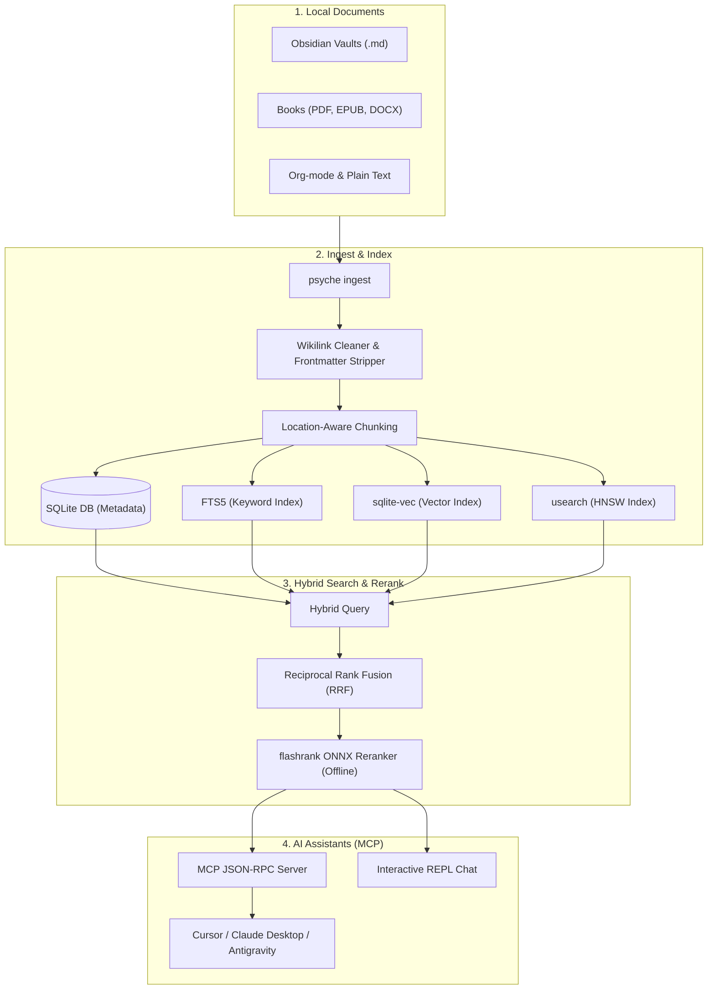

# Psyche 🧠: Local-First RAG & Agentic Memory Layer (MCP Server for Cursor, Claude & Antigravity)

<div align="center">
  <p><strong>Give your AI coding assistant (Cursor, Claude Code, Antigravity) 100% local, persistent memory and instant access to your books, notes, and project guidelines.</strong></p>

  [](https://github.com/Nam-Aniket/psyche)
  [](https://github.com/Nam-Aniket/psyche)
  [](https://github.com/Nam-Aniket/psyche)
  [](https://modelcontextprotocol.io)
  [](https://smithery.ai/server/psyche)
  [](https://github.com/Nam-Aniket/psyche/stargazers)
</div>

---

Psyche turns your personal documents and agent interactions into a local, searchable knowledge layer. It ingests Obsidian vaults, PDFs, EPUBs, Word DOCX, HTML, Org-mode, Markdown, and text files; stores chunks, metadata, embeddings, and FTS5 indexes in SQLite; combines keyword and semantic retrieval with Reciprocal Rank Fusion; and exposes retrieval through a CLI, chat shell, and MCP server.

Expose your brain database directly to Cursor, Claude Desktop, Antigravity, and other MCP-compatible coding assistants so they can fetch relevant books and notes dynamically and maintain persistent agent memory.

---

## 🧠 Stateful Agent Memory (Letta/MemGPT Hierarchy)

Unlike static document-search tools, Psyche provides a full **Stateful Agentic Memory Layer** directly to your AI assistants via the Model Context Protocol (MCP):

1. **Document Knowledge (Archival RAG)**: Hybrid FTS5 (BM25) and vector search over your books, markdown files, and Obsidian vaults (`search_knowledge`).
2. **Core Memory (RAM)**: Key-value facts and project guidelines (e.g. coding preferences, styling choices, naming rules) that the agent writes and reads dynamically (`write_memory_core`).
3. **Archival Memory (Disk)**: Vector-embedded logs, learnings, and debugging context that the agent archives for long-term reference (`append_memory_archival`).
4. **Interaction History (Recall)**: Stateful logging of conversation turns to ensure context persistence across assistant sessions (`record_interaction`).

---

## ⚡ Why Psyche? (Comparison)

| Before Psyche | With Psyche |
| :--- | :--- |
| Copy-pasting chapters or files manually into LLM chat boxes | Expose your entire local library/vault directly via MCP |
| Uploading private notes to cloud AI providers, risking data leaks | **100% local-first** embeddings, indexing, and reranking |
| Cluttering LLM context windows with large, noisy documents | Hybrid retrieval + RRF + Cross-Encoder reranking |
| Sluggish search over raw text files | Sub-millisecond ANN local vector indexing |
| Assistant forgets custom style guides or project rules in new chats | Agent writes core rules via `write_memory_core` which persist indefinitely |

---

## 🏗️ How it Works (System Architecture)



1. **Ingest**: Point Psyche at directories of markdown files or books. It parses them locally.
2. **Process**: Chunks texts, cleans wikilinks, strips frontmatter, and indexes proper nouns for co-occurrence.
3. **Embed & Index**: Generates vector embeddings (local-first via ONNX/fastembed or Ollama) and loads them into a native C-level SQLite vector index (`sqlite-vec`) and HNSW index (`usearch`).
4. **Retrieve**: Merges keyword hits (ranked via FTS5 `bm25`) and semantic matches using **Reciprocal Rank Fusion (RRF)**.
5. **Rerank**: Post-processes candidate chunks using a local, lightweight Cross-Encoder model (`flashrank`) entirely offline.
6. **Serve**: Exposes the search index to your AI assistants via standard JSON-RPC over the Model Context Protocol (MCP).

---

## ⚡ Key Features

*   🌍 **Multi-Path Sync**: Ingest multiple books, documents, or entire directories dynamically (e.g. `psyche ingest ~/Obsidian ~/Downloads/Books`).
*   🕸️ **High-Performance Hybrid Search**: Rerank keyword hits and semantic vector matches using **Reciprocal Rank Fusion (RRF)** and post-rerank with a local ONNX cross-encoder.
*   🔌 **Model Context Protocol (MCP)**: Directly expose your books and notes to LLMs in the background. Assistants can query your brain database dynamically.
*   📓 **Obsidian Note Sync**: Automatically strips YAML frontmatter, extracts markdown tags as keywords, prunes system directories (`.obsidian`, `.trash`), and cleans wikilinks (`[[Concept|Display]]` -> `Display`).
*   🔮 **Optional GraphRAG Concept Map**: Semantic K-Means clustering and proper-noun co-occurrence extraction builder mapping links and definitions across your corpus.
*   🛡️ **100% Local / Offline-First**: Run entirely local embeddings and chat using Ollama (`llama3` + `nomic-embed-text`) or local ONNX models. Fall back to pure-retrieval rich terminal views if no AI provider is configured.

---

## 🚀 Setup & Installation

### 1. Install via NPM (Recommended for Node environments)
Install the package globally using npm:
```bash
npm install -g psyche
```
This automatically handles initializing an isolated Python virtual environment (`.venv`) inside the global module directory and installing all dependencies.

Alternatively, run commands directly without a global installation using `npx`:
```bash
npx psyche query "What is Stoicism?"
```

---

### 2. Install via Pipx (Recommended Python route)
For python environments, you can install the CLI globally and isolated using `pipx`:
```bash
pipx install git+https://github.com/Nam-Aniket/psyche.git
```

---

### 3. Manual Installation (Development Mode)
If you prefer to clone and develop locally:
```bash
git clone https://github.com/Nam-Aniket/psyche.git
cd psyche
./setup.sh
```
This script will initialize a local Python virtual environment, install dependencies in editable mode, and link the global `psyche` command.

---

## 📖 CLI Usage Reference

### 1. Ingesting Notes and Books
Pass files, folders, or directories positionally:
```bash
# Ingest folders recursively
psyche ingest ~/Obsidian/PersonalVault ~/Downloads/Books

# Ingest with tag and directory filters
psyche ingest ~/Obsidian/PersonalVault --ext md,txt

# Keep folders separate under isolated databases
psyche ingest ~/Obsidian/WorkVault --topic career
```

### 2. Searching and Chatting
Ask one-off questions or activate the interactive REPL chat:
```bash
# Query the default database
psyche query "What did Seneca write about focus?"

# Query a specific topic database
psyche query "What is the sprint structure?" --topic career

# Launch interactive chat shell
psyche chat
```
*REPL commands inside Chat*:
*   `/status` — Inspect database sizes, model providers, and active topic.
*   `/sources` — Toggle displaying full matching excerpts in outputs.
*   `/exit` — Exit the chat.

### 3. Optional: Generating GraphRAG Concept Networks
Build semantic relationship diagrams dynamically from co-occurrence statistical links:
```bash
psyche build-graph --clusters 8
```

### 4. Running the MCP Server
Connect coding assistants (such as Antigravity, Claude Desktop, or Cursor) directly:
```bash
psyche start-mcp
```

---

## 🔬 Walkthrough & Sample Output (Proof)

When you run a search in Psyche, it searches your local corpus, matches concepts, ranks them via RRF, and applies cross-encoder reranking. 

Here is real terminal output from a query on an index containing Seneca's letters:

```bash
$ psyche query "What does Seneca say about time?" --top 2
```

```
Query: 'What does Seneca say about time?'

==================================================
OFFLINE / AI-FREE (PURE RETRIEVAL) RESULT
==================================================
Top 2 matching passages for query: 'What does Seneca say about time?'

[Passage 1] Seneca Letters by Unknown [Page 329] (Rerank Score: 0.9850)
----------------------------------------
It is at the same time a sharp-tongued piece of social comment on the hypocrisy of a     
professional orator. The kind of posturing often called for in such a practice  
is fundamentally at odds with the critical application of moral thinking which  
Stoicism in all of its versions recommends. See, however, the description of    
ethically sound rhetoric at .–, where the discourse of Seneca’s former   
teacher Attalus is contrasted with Attalus's warning on time...
----------------------------------------

[Passage 2] Seneca Letters by Unknown [Page 161] (Rerank Score: 0.9843)
----------------------------------------
Seneca recommends a calculation of risk and the reward: a bit of extra 
time is worth little (though not nothing) while the penalty of losing the       
ability to choose the time of one’s death is great. Hence the idea that one     
might consider suicide before the quality of life declines...
----------------------------------------

==================================================
```

---

## 🔌 Integrating with Antigravity / Claude / Cursor

### 🛠️ Automatic Installation via Smithery.ai
To install and configure Psyche for Claude Desktop automatically, simply run:
```bash
npx -y @smithery/cli install psyche --client claude
```

### ⚙️ Manual Configuration
To expose your books and notes database directly to coding assistants manually, add the following configuration block to your MCP host configuration file (e.g., `~/Library/Application Support/Claude/claude_desktop_config.json`):

```json
{
  "mcpServers": {
    "psyche": {
      "command": "npx",
      "args": [
        "-y",
        "psyche",
        "start-mcp"
      ]
    }
  }
}
```
*(Note: If you have installed the package globally using `npm install -g psyche` or `pipx`, you can also configure it directly with command `psyche` and args `["start-mcp"]`.)*

### 💬 Custom Slash Command (`/psyche`)
Once integrated, the psyche server automatically exposes the `/psyche` slash command (via MCP Prompts) to your AI clients (like Claude Desktop or Antigravity). 

You can use it directly in your chat:
*   `/psyche` — initiates the prompt command cleanly without requiring initial arguments, prompting a helpful guiding message.
*   `/psyche query: "your question here"` — retrieves relevant book passages and notes context directly into the current chat, allowing you to ask questions and get instant wisdom inline.

---

## 💬 FAQ

### **Does any of my data leave my machine?**
No. Psyche runs **100% locally**. Vectors are computed locally via ONNX runtime (`fastembed`) or Ollama. Chunk metadata is indexed locally in a SQLite database, and the final candidates are re-scored locally on CPU using an ONNX cross-encoder. 

### **How does the hybrid search work?**
It uses **Reciprocal Rank Fusion (RRF)** to combine lexical search results from SQLite's built-in FTS5 engine (using BM25 scoring) with vector search results. The combined top results are then reranked using a local, lightweight Cross-Encoder (`flashrank`'s `ms-marco-TinyBERT-L-2-v2`) to provide the highest-accuracy context to your LLM.

### **How do I connect this to Cursor?**
Open Cursor Settings -> Features -> MCP, click **+ Add New MCP Server**, and enter:
- **Name:** `psyche`
- **Type:** `command`
- **Command:** `npx -y psyche start-mcp`

### **How do I build the optional GraphRAG concept maps?**
Run `psyche build-graph`. This clusters vectors using K-Means and extracts statistical co-occurrences of proper nouns to build a semantic concept network of your notes.

---

## 🧪 Running Tests
Verify database connections, FTS5 parsers, and similarity algorithms:
```bash
.venv/bin/python -m unittest discover tests
```

---

## ⭐ Support the Project
If you find Psyche useful for giving your AI coding assistants a local brain, please consider starring the repository! It helps other developers discover the project and supports local-first, privacy-focused developer tooling.
