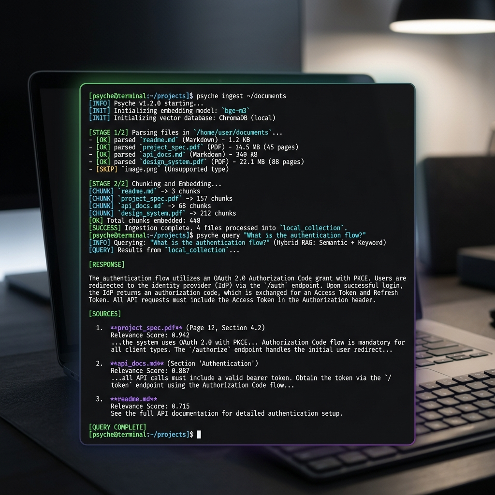

# Psyche 🧠

<div align="center">
  <p><strong>Give any AI assistant searchable, cited access to your private notes and documents.</strong></p>

  [](https://github.com/Nam-Aniket/psyche)
  [](https://github.com/Nam-Aniket/psyche)
  [](https://github.com/Nam-Aniket/psyche)
  [](https://modelcontextprotocol.io)
  [](https://smithery.ai/server/psyche)
  [](https://github.com/Nam-Aniket/psyche/stargazers)
</div>

<div align="center">
  <br/>
  
</div>

---

## 🎯 Why This Matters

> **Turn your Obsidian vaults, books, and documents into a private, local-first searchable knowledge and memory layer for AI assistants.**

Standard LLM assistants operate within a temporary, sliding window of context—every time you start a new chat, your guidelines, preferences, and documentation are completely forgotten. Psyche bridges this gap by giving your AI tools a stateful, local-first memory companion that runs 100% offline. It allows you to build a persistent, private second brain that your coding agents can search, reference, and write to dynamically.

---

## 🔒 Built on Trust (Local-First & Private)

Hosted RAG and document-search tools suffer from a critical privacy problem: they require uploading your private thoughts, diaries, and books to third-party servers.

Psyche is built from the ground up for absolute data safety:
*   🛡️ **100% Local Indexing**: All text parsing, chunking, and vector embedding calculations occur entirely on your local machine using fast ONNX models or Ollama.
*   🚫 **No Silent Uploads**: Your documents never leave your disk.
*   🔍 **Strict Citations**: Every single search result includes direct file paths, chapters, or page numbers so you can immediately verify where the assistant sourced its knowledge.

---

## ⚡ Absurdly Fast Installation (The 2-Step Golden Path)

Ready to connect your documents to your assistant? It takes under 60 seconds.

### 1. Ingest your notes and books
Point Psyche at folders containing markdown, PDFs, EPUBs, Org files, or DOCX documents:
```bash
npx psyche ingest ~/Documents ~/Obsidian
```

### 2. Expose your knowledge as an MCP Tool
Start the Model Context Protocol (MCP) server so Cursor, Claude Desktop, or Antigravity can query it:
```bash
npx psyche start-mcp
```

---

## 🧠 Stateful Agent Memory (Letta/MemGPT Hierarchy)

Rather than treating RAG as a static, read-only search engine, Psyche implements a dynamic, hierarchical memory system for your AI agents:

1.  **Document Knowledge (Archival RAG)**: Hybrid FTS5 (BM25) lexical search and HNSW vector search over your files (`search_knowledge`).
2.  **Core Memory (RAM)**: Key-value facts and project guidelines (e.g. coding preferences, styling choices, naming rules) that the agent writes and reads dynamically (`write_memory_core`).
3.  **Archival Memory (Disk)**: Vector-embedded logs, learnings, and debugging context that the agent archives for long-term reference (`append_memory_archival`).
4.  **Interaction History (Recall)**: Stateful logging of conversation turns to ensure context persistence across assistant sessions (`record_interaction`).

---

## 🍳 Recipes

Here is how you can put Psyche to work immediately:

### 📓 Chat with your Obsidian vault
Ingest your markdown notes recursively. Psyche automatically strips YAML frontmatter, cleans wikilinks (`[[Concept|Display]]` -> `Display`), and extracts tags:
```bash
npx psyche ingest ~/Obsidian/PersonalVault
```

### 📚 Query a folder of PDFs and Ebooks
Ingest a library of research papers, PDFs, or EPUB books. Psyche extracts text and tracks page/location details:
```bash
npx psyche ingest ~/Downloads/Books --ext pdf,epub
```

### 💾 Run fully offline with Ollama
Configure Ollama (`llama3` + `nomic-embed-text`) during the setup wizard to query your index completely offline with no network connection at all:
```bash
npx psyche setup
```

### 🧠 Use Psyche as memory for Codex / Antigravity
Create a `MEMORY.md` file in your repository instructing your agent to call Psyche's memory write-back tools to document and retrieve codebase conventions.

---

## 🏗️ How it Works (System Architecture)


1.  **Ingest**: Scan folders.
2.  **Process**: Chunks texts, cleans markdown syntax, and prepares metadata.
3.  **Embed & Index**: Generates vector embeddings (locally via ONNX/fastembed) and indexes them in a C-level SQLite vector index (`sqlite-vec`) and an HNSW vector index (`usearch`).
4.  **Retrieve**: Merges lexical matches (FTS5 `bm25`) and semantic matches using **Reciprocal Rank Fusion (RRF)**.
5.  **Rerank**: Rescores matches locally on CPU using a lightweight ONNX Cross-Encoder model (`flashrank`).
6.  **Serve**: Exposes search/write tools to editors and LLMs via Model Context Protocol (MCP).

---

## 🔮 Theme Mapping (GraphRAG Concept Networks)

Identify connections across your entire notes collection. Run `psyche build-graph` to cluster vectors using K-Means and map co-occurrences of proper nouns. Ask your assistant conceptual questions like:
*   *"What themes connect my notes on career, discipline, and AI agents?"*
*   *"Summarize how my Stoicism files relate to my writing tips."*

---

## 🚀 Installation & Developer Setup

### 1. Install via NPM (Recommended)
Install the package globally:
```bash
npm install -g psyche
```

### 2. Install via Pipx (Python alternative)
```bash
pipx install git+https://github.com/Nam-Aniket/psyche.git
```

### 3. Clone & Develop Locally
```bash
git clone https://github.com/Nam-Aniket/psyche.git
cd psyche
./setup.sh
```

---

## 🔌 Integrating with Cursor / Claude Desktop / Antigravity

### 🛠️ Automatic Configuration (Smithery.ai)
```bash
npx -y @smithery/cli install psyche --client claude
```

### ⚙️ Manual Configuration (Cursor)
Open **Cursor Settings** -> **Features** -> **MCP**, click **+ Add New MCP Server**:
*   **Name:** `psyche`
*   **Type:** `command`
*   **Command:** `npx -y psyche start-mcp`

### ⚙️ Manual Configuration (Claude Desktop)
Add this to `~/Library/Application Support/Claude/claude_desktop_config.json`:
```json
{
  "mcpServers": {
    "psyche": {
      "command": "npx",
      "args": [
        "-y",
        "psyche",
        "start-mcp"
      ]
    }
  }
}
```

---

## 🧪 Running Tests
Verify database migrations, FTS5 keywords, and vector searches:
```bash
.venv/bin/python -m unittest discover tests
```

---

## ⭐ Support the Project
If you find Psyche useful for giving your AI assistants a local brain, please consider starring the repository! It helps other developers discover the project and supports local-first, privacy-focused developer tooling.
