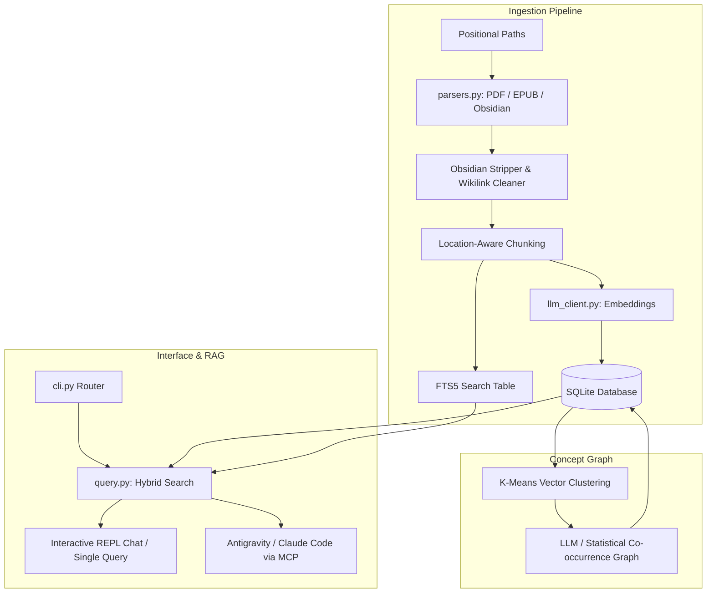

# 🧠 Psyche

[](https://github.com/Nam-Aniket/knowledge-project)
[](https://github.com/Nam-Aniket/knowledge-project)
[](https://github.com/Nam-Aniket/knowledge-project)
[](https://modelcontextprotocol.io)

A premium, lightweight, completely offline-capable **GraphRAG & RAG Engine** for your Obsidian notes, books, and documents. Connect your second brain directly to coding assistants (like Antigravity or Claude) using the built-in **Model Context Protocol (MCP) Server**, or query and chat with it locally via an interactive terminal interface.

<p align="center">
<pre>
    ____  _____  __  __   ______ __  __ ______
   / __ \/ ___/  \ \/ /  / ____// / / // ____/
  / /_/ /\__ \    \  /  / /    / /_/ // __/   
 / ____/___/ /    / /  / /___ / __  // /___   
/_/    /____/    /_/   \____//_/ /_//_____/   
</pre>
</p>


---

## ⚡ Key Features

*   🌍 **Multi-Path Position Sync**: Ingest multiple books, documents, or entire directories dynamically (e.g. `psyche ingest ~/Obsidian ~/Downloads/Books`).
*   🕸️ **Hybrid FTS5 + Semantic Search**: Rerank keyword hits and semantic vector matches using **Reciprocal Rank Fusion (RRF)** for ultra-precise context.
*   🔮 **GraphRAG Concept Map**: Semantic K-Means clustering and LLM-guided schema builders mapping links and definitions across your corpus.
*   📓 **Obsidian Note Sync**: Automatically strips YAML frontmatter, extracts markdown tags as keywords, prunes system directories (`.obsidian`, `.trash`), and cleans wikilinks (`[[Concept|Display]]` -> `Display`).
*   🔌 **Model Context Protocol (MCP)**: Directly expose your books and notes to LLMs in the background. Assistants can query your brain database dynamically.
*   🛡️ **100% Local / AI-Free Fallbacks**:
    *   No API keys needed — run locally using Ollama (`llama3` + `nomic-embed-text`).
    *   **AI-Free Search**: Fall back to pure-retrieval Rich markdown views.
    *   **AI-Free Graphs**: Statistical proper-noun co-occurrence extraction builder.

---

## 🏗️ System Architecture



---

## 🚀 Setup & Installation

### 1. Global Installation (Recommended)
You can install `psyche` globally from the git repository without manually cloning or setting up symlinks (like `npm install -g`):
```bash
pipx install git+https://github.com/Nam-Aniket/knowledge-project.git
```
*(If you do not have `pipx` installed, you can use `pip install git+https://github.com/Nam-Aniket/knowledge-project.git` instead).*

### 2. Manual / Developer Installation (From Source)
If you have cloned the repository locally, you can initialize the environment, install dependencies, link the global `psyche` command, and launch the configuration wizard with a single command:
```bash
python3 cli.py setup
```
*(Alternatively, you can run `./setup.sh` which delegates directly to the Python setup command).*

### 3. Interactive Configuration
Once installed, start the interactive chat from any directory to run the setup wizard and configure your model provider (Gemini, OpenAI, Ollama, or AI-Free):
```bash
psyche chat
```
The wizard runs automatically on the first start (or if you run `psyche setup` or `python3 cli.py setup`) to write your `.env` config file and immediately start chatting!


---

## 📖 CLI Usage Reference

### 1. Ingesting Notes and Books
Pass files, folders, or directories positionally. The tool only reads notes without editing them:
```bash
# Ingest folders recursively
psyche ingest ~/Obsidian/PersonalVault ~/Downloads/Books

# Ingest with tag and directory filters
psyche ingest ~/Obsidian/PersonalVault --ext md,txt

# Keep folders separate under isolated databases
psyche ingest ~/Obsidian/WorkVault --topic career
```

### 2. Searching and Chatting
Ask one-off questions or activate the premium interactive REPL chat:
```bash
# Query the default database
psyche query "What did Seneca write about focus?"

# Query a specific topic database
psyche query "What is the sprint structure?" --topic career

# Launch interactive chat shell
psyche chat
```
*REPL commands inside Chat*:
*   `/status` — Inspect database sizes, model providers, and active topic.
*   `/sources` — Toggle displaying full matching excerpts in outputs.
*   `/exit` — Exit the chat.

### 3. Generating GraphRAG Concept Networks
Build semantic relationship diagrams dynamically:
```bash
# Build concept connections
psyche build-graph --clusters 8
```

### 4. Running the MCP Server
Connect coding assistants (such as Antigravity or Claude Desktop) directly:
```bash
psyche start-mcp
```

---

## 🔌 Integrating with Antigravity / Claude

To expose your books and notes database directly to coding assistants, add the following to your configuration file (e.g., `~/Library/Application Support/Claude/claude_desktop_config.json`):

```json
{
  "mcpServers": {
    "psyche": {
      "command": "/Users/aniketnamjoshi/knowledge-project/.venv/bin/python",
      "args": [
        "/Users/aniketnamjoshi/knowledge-project/cli.py",
        "start-mcp"
      ],
      "env": {
        "DATABASE_PATH": "/Users/aniketnamjoshi/knowledge-project/data/knowledge.db"
      }
    }
  }
}
```

---

## 🧪 Running Tests
Verify database connections, FTS5 parsers, and similarity algorithms:
```bash
.venv/bin/python -m unittest discover tests
```
